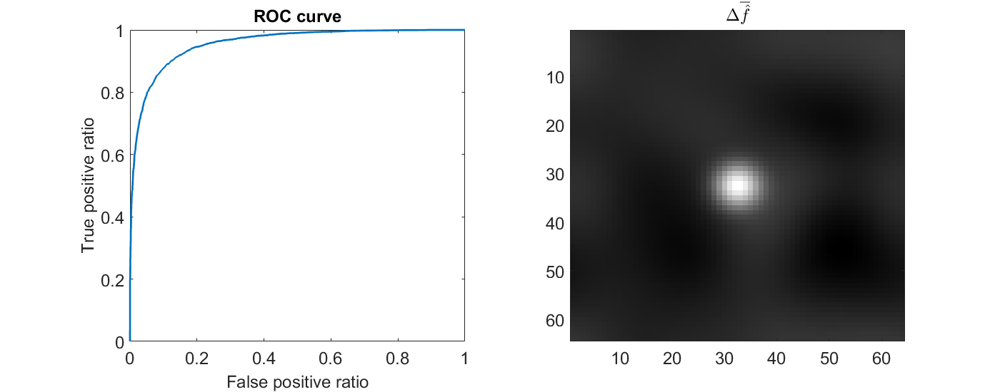

# BME-570-project-code

1. Matlab code to evaluate performance on a signal-detection task:

   `./observer_evaluation/performance_evaluation.m`
   
2. Python code to build a CNN for denoising:

   `./denoising/DL_denoiser.py`

## Observer Evaluation

### Usage
      [AUC] = performance_evaluation(IS,IN)

### Discription
Conduct an observer study using channelized Hotelling observer.
The signal-present images are given by `IS`, the signal-absent are images given by
`IN`. Then compute the AUC, and plot the ROC curves (by simple 
thresholding).

### Inputs 

      IS -- [Number_of_Pixels X Number_of_Images] -- The input signal-present images 
                (Each column represents one image)
      IN -- [Number_of_Pixels X Number_of_Images] -- The input signal-absent images 
                (Each column represents one image)

### Outputs

      AUC -- Wilcoxon area under the ROC curve
      Figures -- ROC curve and delta f_hat_bar image.
      (delta f_hat_bar: the difference between signal-present and signal-absent images)

### Example of output



Matlab command line output:

      AUC = 0.9530

### More to read

Harrison H. Barrett and Kyle J. Myers, *Foundations of Image Science*, Charpter 13.2

-----------------------------------------------
Edited by Zitong Yu @ Nov-16-2021

Based on IQmodelo toolbox Apr-15-2016© the Food and Drug Administration (FDA) and IMAGE QUALITY TOOLBOX Version 0.9b Mar-25-2001© The University of Arizona

Contact: yu.zitong@wustl.edu

## CNN-based denoiser

A simple CNN-based denoiser.

### Python requirements
This code was tested on:
 - Python 3.6
 - TensorFlow 1.10.0
 - Keras 2.2.4

No GPU requirement, since the code runs on CPUs.

### Preparing dataset
Images should be saved as 64X64 `.npy` files.
Use provided `writeNPY()` MATLAB function to save images as `.npy` files.
#### Useage:
      writeNPY(reshape(img,64,64),['image',num2str(img_ind),'.npy']);

The training data should be saved as following:
```
data_dir -- low_dose
               -- image0.npy
               -- image1.npy
               -- ...
         -- normal_dose
               -- image0.npy
               -- image1.npy
               -- ...
```

The test data should be saved as follwoing:
```
data_dir -- low_dose
               -- image0.npy
               -- image1.npy
               -- ...
```

### Running
Run `python DL_denoiser.py -h` for a complete listing of command line parameters and support list of training configurations.
```
usage: DL_denoiser.py [-h] [--dataset-dir DATASET_DIR]
                      [--trained-model TRAINED_MODEL] [--num-train NUM_TRAIN]
                      [--num-test NUM_TEST] [--num-epochs NUM_EPOCHS]
                      [--dim DIM] [--batch-size BATCH_SIZE]

Train the CNN or do the perdiction.

optional arguments:
  -h, --help            show this help message and exit
  --dataset-dir DATASET_DIR
                        Path to dataset.
  --trained-model TRAINED_MODEL
                        Trained model.
  --num-train NUM_TRAIN
                        Number of traing data.
  --num-test NUM_TEST   Number of testing data.
  --num-epochs NUM_EPOCHS
                        Number of epochs.
  --dim DIM             Image size. For example, with (64,64) image, dim = 64.
  --batch-size BATCH_SIZE
                        Batch size.
```
#### Training
To train a network, run:

```python DL_denoiser.py --dataset-dir $your_dataset_directory$  --num-train $number_of_training_samples$ --num-epochs $number_of_epochs$ --dim $image_size$ --batch-size $batch_size$```

An example:

`python DL_denoiser.py --dataset-dir ./data/train/  --num-train 50 --num-epochs 20 --dim 64 --batch-size 8`

A successful training should print the following:

```
Using TensorFlow backend.
__________________________________________________________________________________________________
Layer (type)                    Output Shape         Param #     Connected to
==================================================================================================
input_1 (InputLayer)            (None, 64, 64, 1)    0
__________________________________________________________________________________________________
conv2d_1 (Conv2D)               (None, 64, 64, 16)   160         input_1[0][0]
__________________________________________________________________________________________________
leaky_re_lu_1 (LeakyReLU)       (None, 64, 64, 16)   0           conv2d_1[0][0]
__________________________________________________________________________________________________
dropout_1 (Dropout)             (None, 64, 64, 16)   0           leaky_re_lu_1[0][0]
__________________________________________________________________________________________________
conv2d_2 (Conv2D)               (None, 32, 32, 16)   1040        dropout_1[0][0]
__________________________________________________________________________________________________
leaky_re_lu_2 (LeakyReLU)       (None, 32, 32, 16)   0           conv2d_2[0][0]
__________________________________________________________________________________________________
dropout_2 (Dropout)             (None, 32, 32, 16)   0           leaky_re_lu_2[0][0]
__________________________________________________________________________________________________
conv2d_3 (Conv2D)               (None, 32, 32, 32)   4640        dropout_2[0][0]
__________________________________________________________________________________________________
leaky_re_lu_3 (LeakyReLU)       (None, 32, 32, 32)   0           conv2d_3[0][0]
__________________________________________________________________________________________________
dropout_3 (Dropout)             (None, 32, 32, 32)   0           leaky_re_lu_3[0][0]
__________________________________________________________________________________________________
conv2d_4 (Conv2D)               (None, 16, 16, 32)   4128        dropout_3[0][0]
__________________________________________________________________________________________________
leaky_re_lu_4 (LeakyReLU)       (None, 16, 16, 32)   0           conv2d_4[0][0]
__________________________________________________________________________________________________
dropout_4 (Dropout)             (None, 16, 16, 32)   0           leaky_re_lu_4[0][0]
__________________________________________________________________________________________________
conv2d_5 (Conv2D)               (None, 16, 16, 64)   18496       dropout_4[0][0]
__________________________________________________________________________________________________
leaky_re_lu_5 (LeakyReLU)       (None, 16, 16, 64)   0           conv2d_5[0][0]
__________________________________________________________________________________________________
dropout_5 (Dropout)             (None, 16, 16, 64)   0           leaky_re_lu_5[0][0]
__________________________________________________________________________________________________
conv2d_transpose_1 (Conv2DTrans (None, 32, 32, 32)   8224        dropout_5[0][0]
__________________________________________________________________________________________________
leaky_re_lu_6 (LeakyReLU)       (None, 32, 32, 32)   0           conv2d_transpose_1[0][0]
__________________________________________________________________________________________________
add_1 (Add)                     (None, 32, 32, 32)   0           leaky_re_lu_6[0][0]
                                                                 dropout_3[0][0]
__________________________________________________________________________________________________
conv2d_6 (Conv2D)               (None, 32, 32, 32)   9248        add_1[0][0]
__________________________________________________________________________________________________
leaky_re_lu_7 (LeakyReLU)       (None, 32, 32, 32)   0           conv2d_6[0][0]
__________________________________________________________________________________________________
dropout_6 (Dropout)             (None, 32, 32, 32)   0           leaky_re_lu_7[0][0]
__________________________________________________________________________________________________
conv2d_transpose_2 (Conv2DTrans (None, 64, 64, 16)   2064        dropout_6[0][0]
__________________________________________________________________________________________________
leaky_re_lu_8 (LeakyReLU)       (None, 64, 64, 16)   0           conv2d_transpose_2[0][0]
__________________________________________________________________________________________________
add_2 (Add)                     (None, 64, 64, 16)   0           leaky_re_lu_8[0][0]
                                                                 dropout_1[0][0]
__________________________________________________________________________________________________
conv2d_7 (Conv2D)               (None, 64, 64, 16)   2320        add_2[0][0]
__________________________________________________________________________________________________
leaky_re_lu_9 (LeakyReLU)       (None, 64, 64, 16)   0           conv2d_7[0][0]
__________________________________________________________________________________________________
dropout_7 (Dropout)             (None, 64, 64, 16)   0           leaky_re_lu_9[0][0]
__________________________________________________________________________________________________
conv2d_8 (Conv2D)               (None, 64, 64, 1)    145         dropout_7[0][0]
__________________________________________________________________________________________________
leaky_re_lu_10 (LeakyReLU)      (None, 64, 64, 1)    0           conv2d_8[0][0]
==================================================================================================
Total params: 50,465
Trainable params: 50,465
Non-trainable params: 0
__________________________________________________________________________________________________
Loading the training data...
Training...
Train on 400 samples, validate on 100 samples
Epoch 1/100
40/40 [==============================] - 3s 78ms/step - loss: 21.6744 - val_loss: 20.1661

<... snip ...>

Training finished.
```

A trained model will be saved in the current directory.

#### Testing
To test a network, run:

```python DL_denoiser.py --dataset-dir $your_dataset_directory$  --num-test $number_of_test_samples$  --dim $image_size$ --batch-size $batch_size$ --trained-model $the_trained_model$```

An example:

`python DL_denoiser.py --dataset-dir ./data/test/  --num-test 50  --dim 64 --batch-size 8 --trained-model ./model_epochs20.h5`

A successful training should print the following:

```
Using TensorFlow backend.

<... Model structure, snap ...>

Total params: 50,465
Trainable params: 50,465
Non-trainable params: 0
__________________________________________________________________________________________________
Loading the test data...
100/100 [==============================] - 1s 13ms/step
Saving the predicted data...
```

The predictions will be saved in the `$your_dataset_directory$/prediction`.

-----------------------------------------------
Edited by Zitong Yu @ Nov-19-2021

Contact: yu.zitong@wustl.edu
